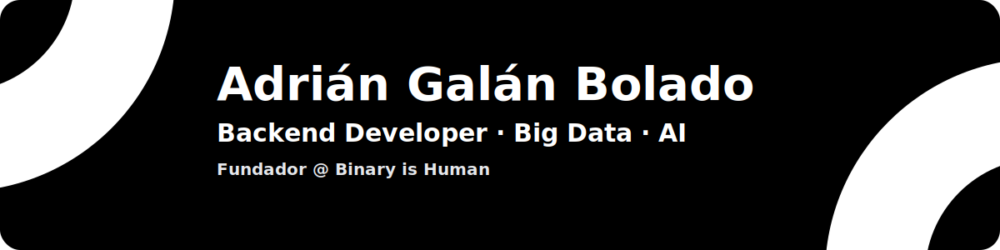

---

## 👨‍💻 Sobre mí
Transformo procesos manuales en **flujos automáticos** que reducen costes y aceleran la operación, aplicando **IA** y **Big Data** solo cuando aportan valor, y entregando **soluciones sencillas a problemas difíciles**, medibles desde el primer día.

---

## 🚀 Tecnologías y herramientas

<table align="center" width="100%">
  <tr>
    <th>🧩 Lenguajes</th>
    <th>🗄️ Backend</th>
    <th>🖥️ Frontend</th>
    <th>🤖 IA & Ciencia de Datos</th>
    <th>🏗️ Big Data & Orquestación</th>
    <th>🗄️ Bases de datos</th>
    <th>⚙️ DevOps & Cloud</th>
    <th>🧪 APIs & Tooling</th>
    <th>🗺️ Geoespacial & Otros</th>
  </tr>
  <tr>
    <td align="center">
       
       
       
       
       
      
    </td>
    <td align="center">
       
       
       
      
    </td>
    <td align="center">
       
      
    </td>
    <td align="center">
       
       
       
       
       
       
       
      
    </td>
    <td align="center">
       
       
       
      
    </td>
    <td align="center">
       
       
      
    </td>
    <td align="center">
       
       
       
       
       
       
       
      
    </td>
    <td align="center">
       
       
      
    </td>
    <td align="center">
       
      
    </td>
  </tr>
</table>

---

## 📊 Lo que hago

- 🔁 **Automatización**: convierto tareas manuales en **flujos sin intervención** con trazabilidad y alertas → menos coste y menos errores.
- 🗄️ **APIs & Backend**: microservicios con contratos claros (FastAPI / Spring), seguridad, CI/CD y **observabilidad** desde el día uno.
- 📦 **Data pipelines**: ingesta de fuentes externas/CRM, **calidad de datos** y ETL/ELT (batch & streaming) con Spark/Kafka/Airflow.
- 🤖 **IA pragmática**: NLP/visión donde hay ROI; modelos **empaquetados como servicios** y monitorizados en producción.
- 📈 **Métricas que deciden**: KPIs y **dashboards en Power BI** con alertas para mover la operación, no solo verla.

## 📈 Stats y actividad

  <!-- 🔥 Racha -->
  

  <!-- 📊 Stats & 🌐 Lenguajes (en dos columnas) -->
  <table>
    <tr>
      <td>
        
      </td>
      <td>
        
      </td>
    </tr>
  </table>

  <!-- 🗺️ Gráfico de actividad -->
  

  <!-- 🏆 Trofeos (opcional) -->
  

## ⚡ Actividad reciente
<!--START_SECTION:activity-->
<!--END_SECTION:activity-->

---
